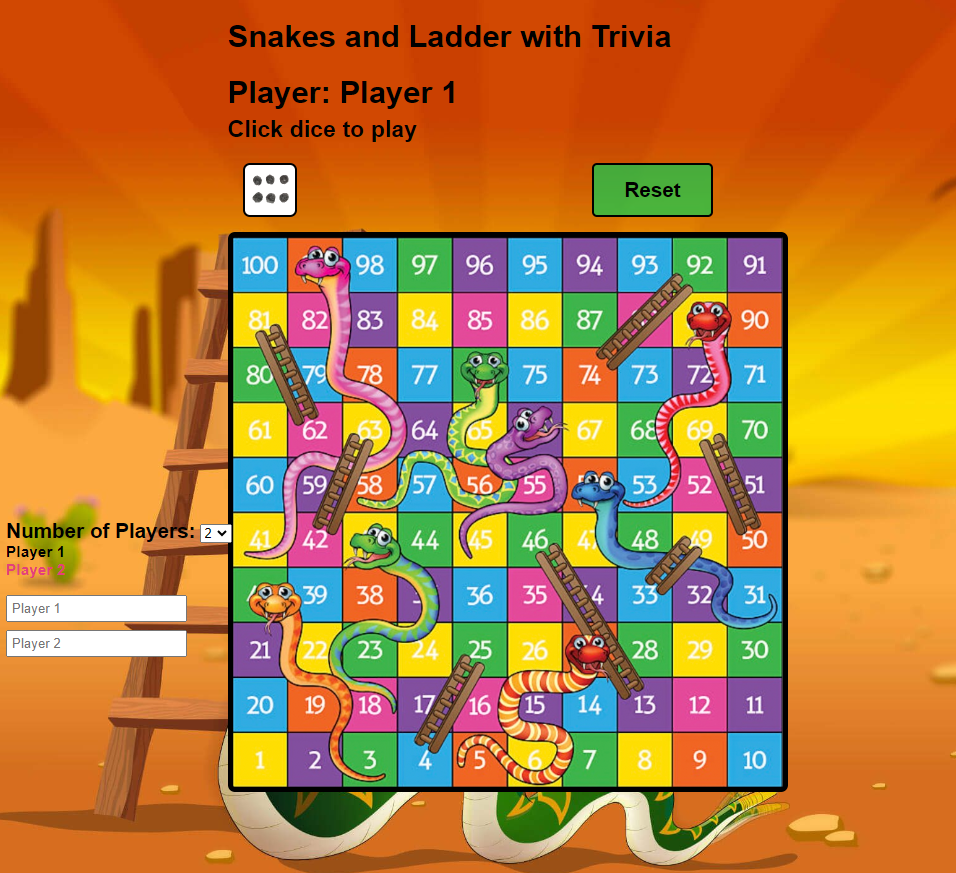

# Snakes and Ladders game with Trivia Questions
The “Snake and Ladders with Trivia” game is a web-hosted game designed in response to the increasing demand for engaging virtual experiences in a world where remote work and online gatherings have become so common in day-to-day life. This game can be played during video calls, with one person taking control of the game interface, while others participate, interact, and enjoy the experience. This documentation provides a comprehensive overview of the project, including its features, setup instructions, and gameplay mechanics, all aimed at fostering interaction, engagement, and entertainment within a virtual environment.

# Contributions:
- Anvitha Yerneni(C91145055)- ayernen@clemson.edu
- Harika Banda (C11992631)- hbanda@clemson.edu
- Mo Shujaa Aldeen - mshujaa@clemson.edu
# Livelink
https://moaldeen.github.io/snake_ladder_trivia/

# Screenshot

# Game objective and rules:
- The theme of the Snake and Ladders with Trivia game can be described as interactive with a little twist on the traditional Snake and Ladders board game. The game board, dice, and player tokens are designed to be visually appealing, with drawings that immerse players in a lively and engaging atmosphere. The game introduces a twist to be different from the classic Snakes and Ladders board game by using the ChatGPT API to pop up questions when players encounter snakes and ladders.
 
- The game is designed for a group of two, three, or four players, with their names being displaced during their turn’s. While the game master directly controls the game, the other players interact verbally or through the chat option in a video call environment (Zoom, Skype, Google Meet, etc) and they can reset the game if needed in between the play. This promotes collaboration and social interaction among players as they discuss strategies, answer questions, and make decisions together. It encourages teamwork and communication.
 
- The game retains the classic gameplay mechanics of Snake and Ladder, making it familiar and accessible. Players aim to reach the top of the game board by rolling the dice, and they face the challenges and surprises of snakes and ladders along the way.

# Technology and Libraries used:
**1. HTML:** The part of the code is written in HTML, which provides the structure and content for the web page.
 
**2. CSS:** We used Cascading Style Sheets (CSS) for styling the web page elements. It included styles for layout, colors, fonts, and more. Also to integrate an external image file of dice into the UI/UX of the game, we linked an external stylesheet with the URL https://assets.codepen.io/215128/diceSpots.png. which is taken from CodePen, an online development environment that allows developers to create and share web projects, including HTML, CSS, and JavaScript.
 
**3. JavaScript:** Javascript programming language is the backbone of our game since all functions that handle the game’s mechanics, user interactions and random question generation when faced with obstacles are designed and coded in JavaScript.
 
**4. Canvas:** The HTML5 `<canvas>` element is used to draw the game board and provide a platform for rendering the game's grid and player movements.
 
**5. Audio & Image files:** To make the game more attractive to the audience, we have embedded two audio files "dice_sound.wav" and "jump.mp3” for dice rolling, ladder jumping, or snake biting, “BGM.jpg” for the background, and also two aesthetically pleasing images taken from popular image sourcing websites.
 
**6. GSAP (GreenSock Animation Platform):** We utilized the GreenSock Animation Platform, which is a popular JavaScript animation library, to enhance the interactive elements and animations in our game. This library was accessed through 'unpkg,' a widely recognized content delivery network (CDN) specializing in delivering front-end web development libraries and packages for seamless integration into websites and web applications.
 
**7. Open API:** The Fetch API is used for making HTTP requests to the OpenAI API. It is employed to request and retrieve random trivia questions that are displayed in the game. We have integrated this third-party OpenAI API to make our game more appealing to the audience.
 
**8. GitHub Pages and GitHub repositories:** We have utilized GitHub repositories for code collaboration and GitHub pages to host our game. The reason to choose GitHub pages over other hosting platforms is that it provides the opportunity to host our static game directly from our GitHub repositories.

# Setup and deployment instructions:

1. **Hosted Repository:** Our Snake and Ladders Trivia game is hosted on GitHub pages and uses GitHub repositories for version control and code collaboration. 
Our GitHub repository link: https://github.com/moaldeen/snake_ladder_trivia 
and our game Web URL: https://moaldeen.github.io/snake_ladder_trivia/

2. **Virtual game environment setup through web hosting:**  We can play this game in a virtual environment like a video call or video conference applications like Zoom, Google Meet, Skype, etc., by just sharing the link: https://moaldeen.github.io/snake_ladder_trivia/
If desired to play in a local environment, applications like VS Code can be used, or you can simply paste the game URL in the desired browser.
 
3. **Game Instructions:** Staying true to the timeless rules of Snake and Ladder, our game ensures a sense of familiarity and accessibility for all players. The primary goal is as classic as ever: roll the dice, ascend to the top of the game board, and navigate the challenges posed by snakes and ladders. What makes our version distinct is the incorporation of the ChatGPT API. This innovative addition pops up engaging questions for players whenever they encounter snakes and ladders, injecting a delightful twist into the traditional gameplay.

- Start the game by having one player take control of the interface. This player can roll the dice and move the pieces according to the game's rules. The remaining participants can interact by giving instructions, answering questions, and enjoying the game together. Once the game session is complete, you can declare a winner and enjoy
  
4.** Trivia Question Generation: **The primary purpose of using OpenAi api GPT-3 model  is to fetch random trivia questions and present them to the player. It sends a request to the OpenAI API, specifying the engine (text-davinci-003) and a prompt that instructs GPT-3 to generate a trivia question in an array format. The response is then parsed, and the generated trivia question is extracted along with answer choices.

5. **Configuration:** The configuration of our game involves several key components. We structure the web page using HTML, which defines its content. For styling, Cascading Style Sheets (CSS) are utilized, incorporating styles for layout, colors, fonts, and the integration of an external image (dice) via an external stylesheet from CodePen. JavaScript is the pivotal language that drives the game's mechanics, user interactions, and the generation of random questions when faced with obstacles. The HTML5 `<canvas>` element is employed for rendering the game board and facilitating grid and player movements. To enhance the player's experience, audio files (dice rolling and ladder jumping/snake biting) are embedded in the game. We've leveraged the GreenSock Animation Platform (GSAP), a renowned JavaScript animation library, to add interactive elements and animations. Additionally, we've harnessed the Fetch API to make HTTP requests to the OpenAI API, fetching random trivia questions to engage the audience and elevate the gaming experience. These various components come together to create an engaging and dynamic game.

# Reflection:
 
- One of the most significant challenges we faced was integrating the ChatGPT API into our code to generate questions when the player reaches the grid where there is a Snakehead or foot of the Ladder. To tackle this challenge, we needed an in-depth understanding of the code structure, functionality of ChatGPT API and rigorous functional testing. While this challenge was indeed demanding, it showcased our team's commitment to delivering an exceptional user experience without compromise.
 
- Another biggest challenge is to make our game aesthetically pleasing. Selecting the right images and sounds was not a quick and easy task. It required a keen eye for detail and a deep understanding of the game's story. Every image had to fit seamlessly into the narrative, and every sound had to contribute to the overall experience. It was a painstaking process, but the final outcome was worth the effort. Test users not only appreciated the enhanced visuals and sounds, but they also reported feeling a deeper connection to the game.
 
- The lessons we garnered from these experiences were priceless. We learned the significance of thorough planning and the necessity of extensive research when making third-party tools integrated to the static web game. Our journey reinforced the idea that you can innovate and preserve the essence of a product, but it requires a patient and meticulous approach. The challenges we overcame underscored the fact that, with the right mindset and determination, even the most formidable obstacles can be conquered.
 
- Developing the trivia game using GPT-3 posed several challenges and learning opportunities. First, one of the initial challenges was the security of the API key. Pushing the API key to a public repository on GitHub is not secure, and it resulted in the key being disabled. This security concern led to the need to find a secure way to manage and use the API key Utilizing GitHub Actions for securely managing the API key was a success. This allowed you to automate the process of fetching and setting the API key without exposing it in the codebase.
 
- Furthermore, the choice of GPT-3 model had an impact on performance. The initial model, "text-davinci-2," was slow in generating answers. This could lead to a suboptimal user experience. Therefore, Transitioning from "text-davinci-2" to "text-davinci-3" model was successful. The latter model provided faster response times, enhancing the user experience by reducing delays in generating answers to trivia questions.

- Finally implementing the mechanism to generate popup trivia questions when the player encounters an obstacle was a challenge. Ensuring that the game's flow seamlessly integrated with the question generation and user interaction was not straightforward. Although we made it work, further refinements and user experience improvements might be needed.
 

# Credits:
1. Board image downloaded from Adobe Stock images: https://stock.adobe.com/search?k=Snakes+and+Ladders&asset_id=110727701
2. Dice image from codepen: https://assets.codepen.io/215128/diceSpots.png
3. Dice rolling sound from pixabay: https://pixabay.com/sound-effects/search/dice/
4. Jump sound – “Cartoon Ladder Climbing” from pond5: https://www.pond5.com/search?kw=climbing-ladder&media=sfx
5. Snakes ladders game using JavaScript and Gsap:  https://github.com/peter-kimanzi/snakes-ladders-game
